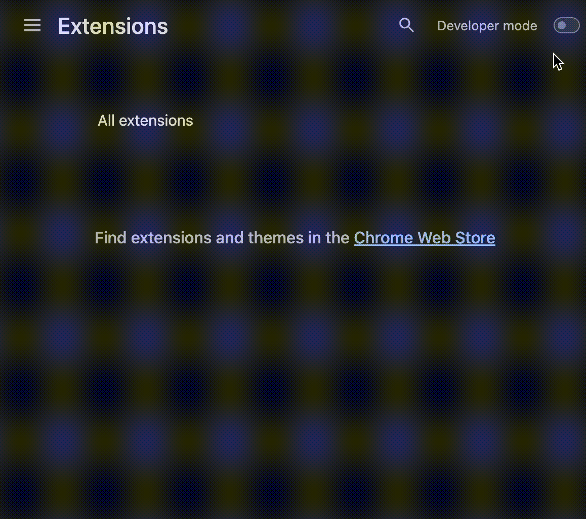
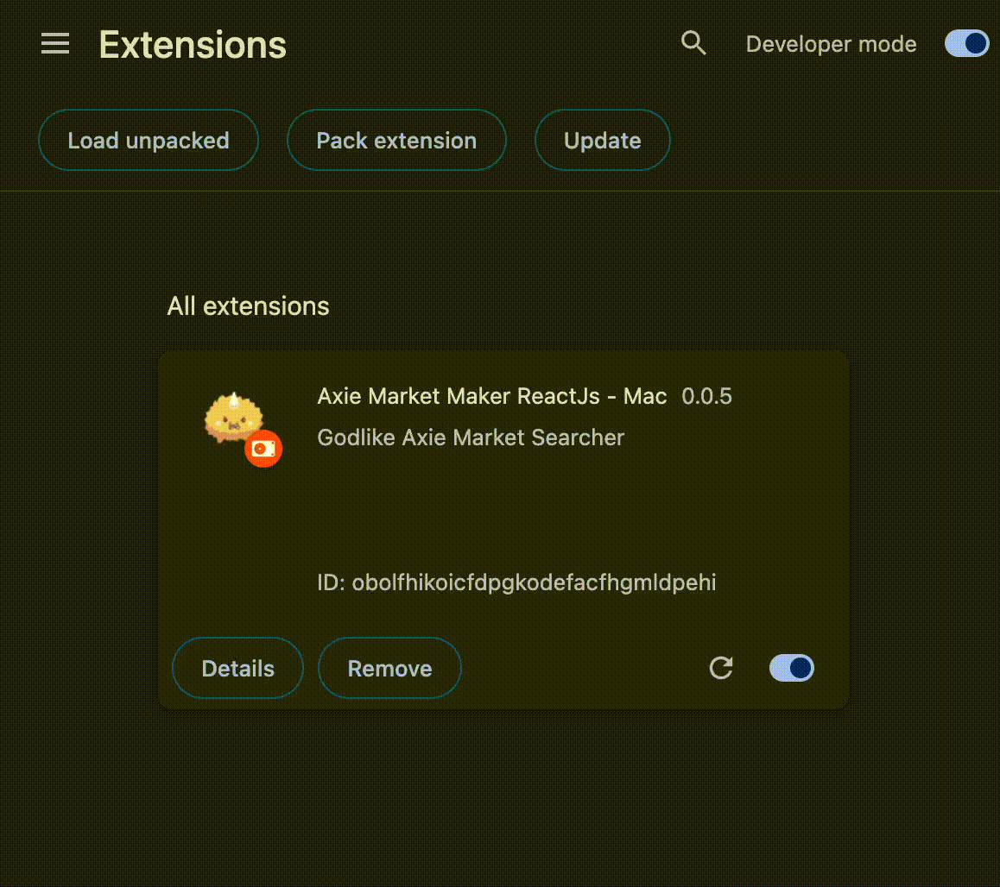
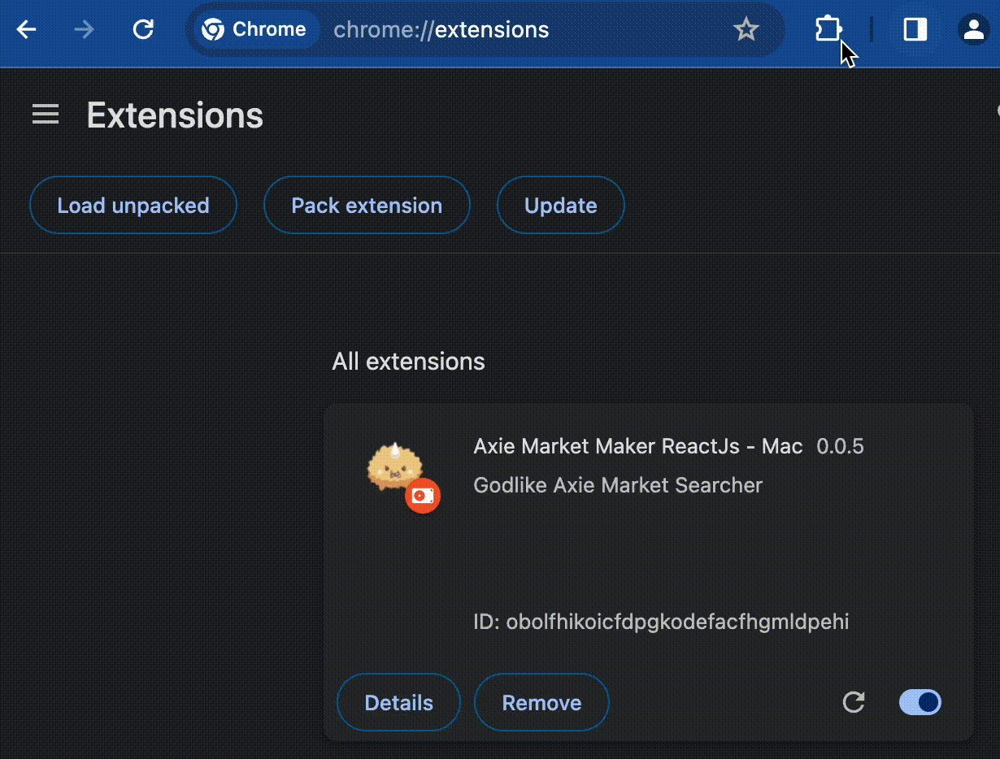
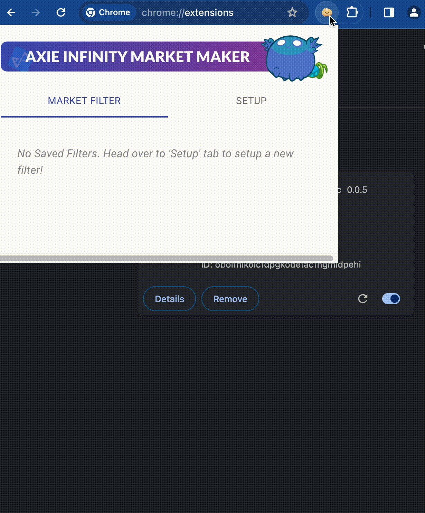
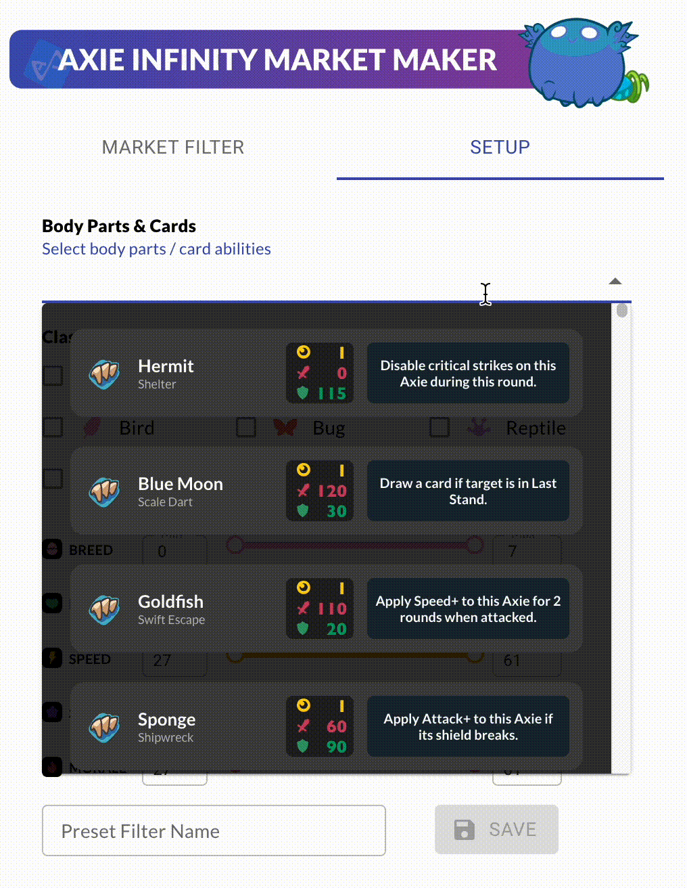
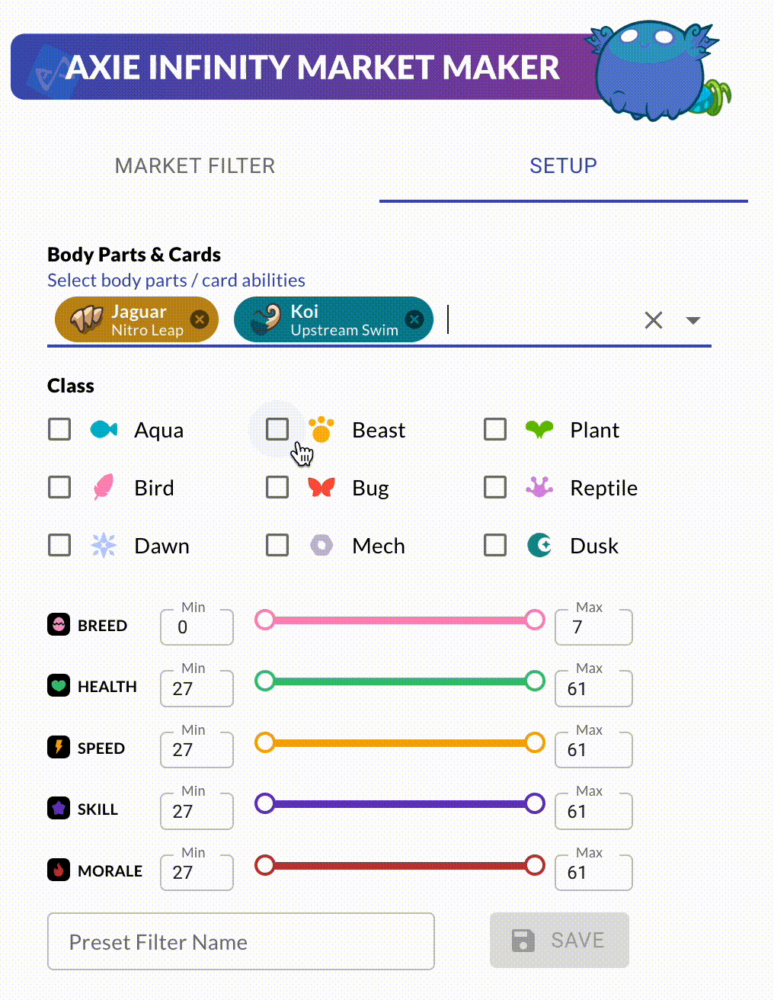
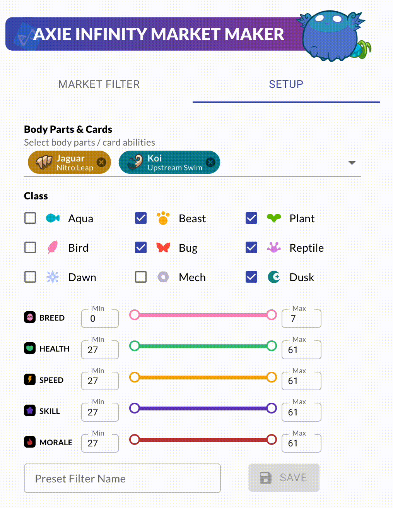
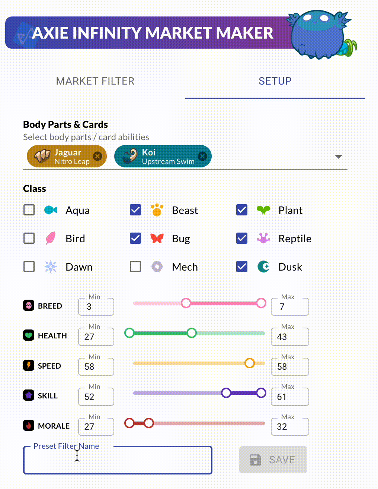
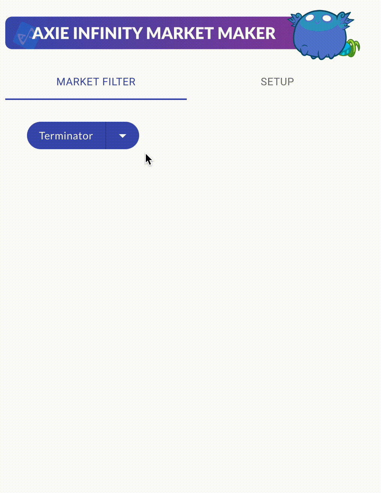

> ⚠️ This project is no longer maintained, updated, and its functionality may be deprecated.


# Axie Traits Filter Bookmark - Chrome Extension

## Overview
[Axie Infinity](https://axieinfinity.com/) is a blockchain-based digital pet universe where players collect, breed, and battle fantasy creatures called Axies.

Axie Market Maker is a Google Chrome Browser Extension developed in React TypeScript. to enhance Axie Infinity users' experience on the [Axie Infinity marketplace](https://app.axieinfinity.com/marketplace/). 

<i>**Note**: This Chrome Extension is no longer functional as Axie Infinity marketplace has been revamped as of 05 May 2022 - read blog post [here](https://blog.axieinfinity.com/p/axie-marketplace-update)</i>

### Example
|  Aqua Shrimp |  Dusk Termi |
|-------------|------------|
|||

|  Mech Double Horn |  Reptile Termi |
|-----------------|---------------|
|||

## Motivation
This extension was created to address a limitation in the Axie marketplace where users had to manually save individual searches or keep browser tabs open for specific searches. 

With the rapid buy / sell activities during the peak of Axie Infinity, having a quick and efficient way to search for Axies with desired traits and stats became essential. Axie Market Maker simplifies this process by enabling users to save and apply custom filters effortlessly.

## Features
🛟 **Custom Filters**: Users can easily create custom filters by selecting Axie attributes. Users can save it for future use.
* **Body Parts**: 36 Back Parts | 36 Horn Parts | 24 Mouth Parts | 36 Tail Parts
* **Axie Classes**: 9 Classes 
* **Stats**: 4 Stats (27-61 Pts)    
* **Breed**: Number of times the Axie has been bred 

🔍 **Quick Automated Searches**: Saved filters can be quickly applied to search the Axie marketplace with just a click by utilizing DOM evaluator to automate the process, saving users from manual input.

🗂️ **Filter Saving**: Filters are saved in user's local storage to ensure persistence across sessions.

## Installation
1. Clone the repository
```
git clone https://github.com/nephydecode/axie-market-maker-rts.git
```
2. Run build
```
npm run build
```
3. Open Chrome and go to `chrome://extensions`.

4. Enable `Developer Mode` in the top right corner & Click on `Load Unpacked`

    

5. Select the `build` folder
6. Hooray! The extension is ready for use 😎

    

7. (Optional) Pin the extension to use it quickly

    

## Usage
1. Click on the Axie Market Maker icon in the Chrome toolbar to open the extension.

    

2. Go to the `Setup` tab & create a custom filter by selecting the desired Axie attributes.

    (a) Select the Axie Body Parts either by selecting from dropdown / quick search
    |Select Dropdown|Type for Quick Search|
    |-------------|------------|
    |||

    (b) Select Axie Class
    
    

    (c) Adjust Axie Stats

    

    (d) Give a name to your filter & save it!

    

3. Go to the 'Market Filter' tab to check out your filters

    

4. To apply a save filter, go to [Axie Infinity marketplace](https://app.axieinfinity.com/marketplace/) & simply click on any of your filters.
5. Sit back, relax & watch your the extension automatically enter the selected filter into the marketplace & initiate the search!
6. To delete a filter, simply click on the arrow down ▽ beside the filter & click 'Delete'

    


7. **Happy Axie-hunting! 🎮🦊**

## Future Enhancement
🧬 **Saved Genes Filter**
- Users will be able to view & filter axies by their genes
- As genes are not directly visible & able to be filtered, this feature will make use of scanning each axie & its genes, then fiter the axies once more after applying the official filter search

📲 **Multi-Device Account Sync**
- Users will have the ability to create personalised profiles, allowing them to save their custom filters & access them across different browsers & devices
- Users will have an easier time managing & tracking Axies on the marketplace searches

## Contributors
* [nephydecode](https://github.com/nephydecode/)

## License
This project is licensed under the [MIT License](https://opensource.org/license/MIT).